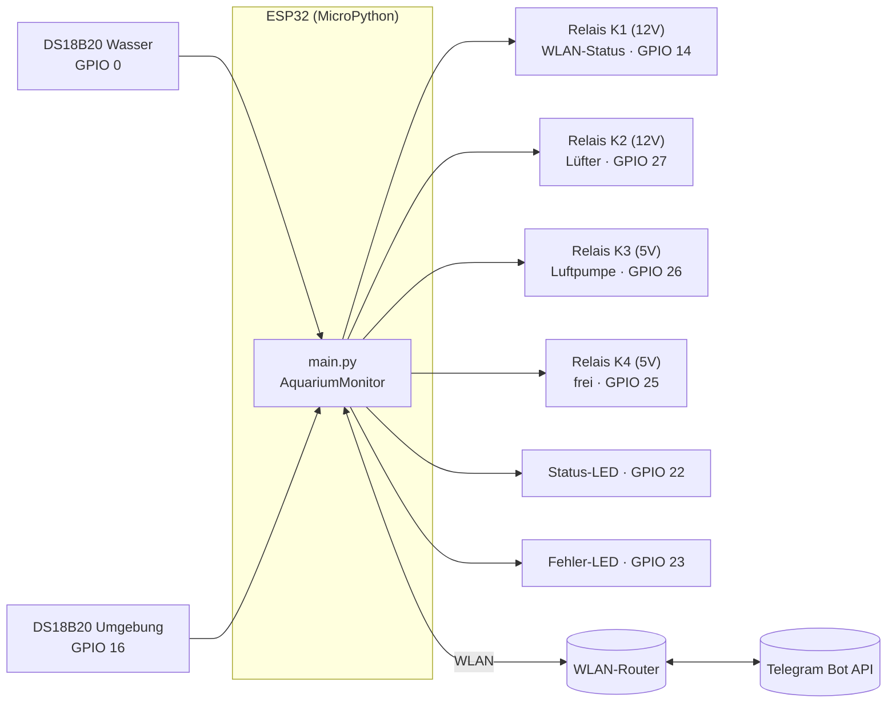
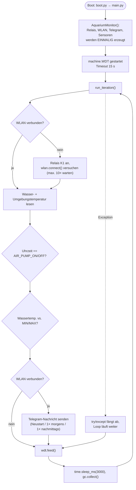

# captain_nemo

Spring 2019 - long weekend at Triest (Italy). As we came home we saw, that it was a doomsday weekend in our aquarium. 5 fishes died, the wather was lightly green.
26°C was to warm.

So the problem was clear. This should never happen.

Project Captain-Nemo was born.

## Was das Projekt macht

Ein ESP32 überwacht Wasser- und Umgebungstemperatur eines Aquariums (via DS18B20-Sensoren), steuert darüber automatisch Lüfter und Luftpumpe per Relais, schickt zweimal täglich (und bei jedem Neustart) den aktuellen Status per Telegram, und versucht dauerhaft im Hintergrund eine WLAN-Verbindung aufrechtzuerhalten. Ein Hardware-Watchdog sorgt dafür, dass sich das Gerät selbst neu startet, falls die Firmware sich aufhängt.

## Architektur

### Komponentenübersicht



### Ablauf der Hauptschleife



**Warum der Watchdog wichtig ist:** Bleibt `run_iteration()` irgendwo hängen (Netzwerk-Timeout, Sensor-Deadlock etc.), wird `wdt.feed()` nicht mehr aufgerufen. Nach 15 Sekunden ohne Feed löst der ESP32 selbstständig einen Reset aus — kein manuelles Eingreifen mehr nötig.

## Software-Struktur

| Datei | Zweck |
|---|---|
| [boot.py](boot.py) | Wird bei jedem Boot ausgeführt (auch nach Deep-Sleep), aktuell leer |
| [main.py](main.py) | Einstiegspunkt: `AquariumMonitor`-Klasse + Hauptschleife mit Watchdog |
| [config.py](config.py) | Projektname für Telegram-Nachrichten |
| [Temperature/temperature.py](Temperature/temperature.py) | Liest DS18B20-Sensoren über OneWire aus, Mittelwertbildung |
| [Notification/telegram.py](Notification/telegram.py) | Sendet Statusnachrichten per Telegram Bot API |
| [WlanNetwork/wlanconnection.py](WlanNetwork/wlanconnection.py) | WLAN-Verbindungsaufbau inkl. NTP-Zeitsynchronisation |
| [GpioControl/ActorControl.py](GpioControl/ActorControl.py) | Ein-/Ausschalten eines Relais-Kanals |
| [GpioControl/LedControl.py](GpioControl/LedControl.py) | Status-/Fehler-LEDs blinken lassen |
| `*/config.py` | Je Modul eigene Konfiguration (siehe unten) |

## Konfigurationsparameter

### `config.py` (Projekt-Root)

| Parameter | Bedeutung |
|---|---|
| `AQUARIUM_NAME` | Name, der als Präfix in jeder Telegram-Nachricht erscheint |

### `WlanNetwork/config.py` ⚠️ enthält Secrets, nicht in Git

Nicht eingecheckt (`.gitignore`) — vor dem ersten Deploy aus der Vorlage anlegen:

```bash
cp WlanNetwork/config.example.py WlanNetwork/config.py
```

| Parameter | Bedeutung |
|---|---|
| `SSID` | Name des WLAN-Netzwerks |
| `PASSWORD` | WLAN-Passwort im Klartext |
| `DHCP_HOSTNAME` | Hostname, unter dem sich der ESP32 im Netzwerk meldet |

### `Notification/config.py` ⚠️ enthält Secrets, nicht in Git

```bash
cp Notification/config.example.py Notification/config.py
```

| Parameter | Bedeutung |
|---|---|
| `CHAT_ID` | Telegram-Chat/-Gruppe, an die Nachrichten gesendet werden |
| `BOT_TOKEN` | Token des Telegram-Bots (von [@BotFather](https://t.me/BotFather)) |

### `GpioControl/config.py`

| Parameter | GPIO | Bedeutung |
|---|---|---|
| `ACTOR_GPIO_WLAN` | 14 | Relais K1 (12V) — an, solange kein WLAN verbunden ist |
| `ACTOR_GPIO_FREE` | 25 | Relais K4 (5V) — aktuell unbenutzt |
| `ACTOR_GPIO_AIR_PUMP` | 26 | Relais K3 (5V) — Luftpumpe |
| `ACTOR_GPIO_FAN` | 27 | Relais K2 (12V) — Lüfter/Kühlung |

### `Temperature/config.py`

| Parameter | Bedeutung |
|---|---|
| `TEMPERATURE_MIN` | Unterhalb dieser Wassertemperatur (°C) wird der Lüfter (K2) eingeschaltet |
| `TEMPERATURE_MAX` | Oberhalb dieser Wassertemperatur (°C) wird der Lüfter (K2) ausgeschaltet |
| `ONE_WIRE_GPIO_AMBIENT` | GPIO des DS18B20 für die Umgebungstemperatur |
| `ONE_WIRE_GPIO_WATER` | GPIO des DS18B20 für die Wassertemperatur (GPIO 0 ist ein Boot-Strapping-Pin — siehe Hinweis unten) |

### `Airpump/config.py`

| Parameter | Bedeutung |
|---|---|
| `AIR_PUMP_ON` | Stunde (0–23, UTC), zu der die Luftpumpe (K3) eingeschaltet wird |
| `AIR_PUMP_OFF` | Stunde (0–23, UTC), zu der die Luftpumpe (K3) ausgeschaltet wird |

`time.gmtime()` liefert **UTC**. Die Werte sind deshalb als `19 - 2` bzw. `20 - 2` geschrieben — das `-2` rechnet die gewünschte Lokalzeit (19:00 / 20:00 in MESZ, UTC+2) auf UTC um. Bei anderer Zeitzone oder Winterzeit (UTC+1) entsprechend anpassen.

### `Notification/telegram.py` — Konstruktor-Parameter der `Telegram`-Klasse

| Parameter | Default | Bedeutung |
|---|---|---|
| `project_name` | `"--not set--"` | wird durch `AQUARIUM_NAME` aus `config.py` gesetzt |
| `morning_hour_message` | `8 - 2` (= 6 UTC) | Stunde für die morgendliche Statusnachricht (gleiche UTC-Umrechnung wie oben) |
| `afternoon_hour_message` | `16 - 2` (= 14 UTC) | Stunde für die nachmittägliche Statusnachricht |

### `main.py`

| Parameter | Bedeutung |
|---|---|
| `WATCHDOG_TIMEOUT_MS` | Zeit in Millisekunden, nach der der Watchdog ohne `feed()` einen Reset auslöst (aktuell 15000 = 15 s) |

## Setup — Schritt für Schritt

1. **Hardware verkabeln** gemäß der GPIO-Tabelle oben (2× DS18B20 mit Pull-up-Widerstand ~4,7 kΩ am Datenpin, 4-Kanal-Relais-Modul, 2 LEDs mit Vorwiderstand an GPIO 22/23).
   > ⚠️ GPIO 0 ist ein Boot-Strapping-Pin des ESP32 (muss beim Einschalten high/floating sein, um normal zu booten). Funktioniert mit dem OneWire-Pull-up meist problemlos, aber im Hinterkopf behalten, falls das Board nicht bootet.
2. **MicroPython-Firmware** auf den ESP32 flashen (z. B. mit [esptool.py](https://github.com/espressif/esptool) oder Thonny).
3. **Repo klonen** und ins Projektverzeichnis wechseln.
4. **Echte Zugangsdaten anlegen** (werden bewusst nicht in Git versioniert):
   ```bash
   cp WlanNetwork/config.example.py WlanNetwork/config.py
   cp Notification/config.example.py Notification/config.py
   # in beiden Dateien die Platzhalter durch echte Werte ersetzen
   ```
5. **Dateien auf den ESP32 übertragen**, z. B. mit [`mpremote`](https://docs.micropython.org/en/latest/reference/mpremote.html) (`pip install mpremote`):
   ```bash
   PORT=/dev/cu.usbserial-0001   # unter macOS; unter Linux z. B. /dev/ttyUSB0

   mpremote connect $PORT fs cp boot.py :boot.py
   mpremote connect $PORT fs cp config.py :config.py
   mpremote connect $PORT fs cp main.py :main.py
   for dir in Airpump GpioControl Notification Temperature WlanNetwork; do
     mpremote connect $PORT fs cp -r "$dir" :
   done
   ```
   `tests/`, `.github/`, `README.md`, `.gitignore` und `*.example.py` gehören **nicht** auf das Gerät.
   > **Troubleshooting:** Meldet `mpremote` `could not enter raw repl`, steckt das Board meist gerade in einer Endlosschleife (z. B. WLAN-Verbindungsversuch). Befehl einfach erneut ausführen oder kurz die Reset-Taste am Board drücken — das ist ein bekannter Timing-Effekt beim automatischen Reset über die serielle Schnittstelle.
6. **Board neu starten** (Reset-Taste oder Stromzyklus) und optional den seriellen Monitor beobachten:
   ```bash
   mpremote connect $PORT
   ```
7. **Tests lokal ausführen** (reines `unittest`, keine zusätzlichen Abhängigkeiten):
   ```bash
   python3 -m unittest discover -s tests -v
   ```
8. **CI:** [.github/workflows/tests.yml](.github/workflows/tests.yml) führt dieselben Tests automatisch bei jedem `git push`/Pull Request aus (Ergebnis im GitHub-Tab „Actions“).

## Tests

Siehe [tests/](tests/) — `tests/micropython_mocks.py` stellt Stubs für die MicroPython-only-Module (`machine`, `network`, `ds18x20`, `onewire`, `ntptime`, `urequests`) bereit, damit die Logik unter normalem CPython (auch in CI) testbar ist, ohne echte Hardware zu benötigen.
